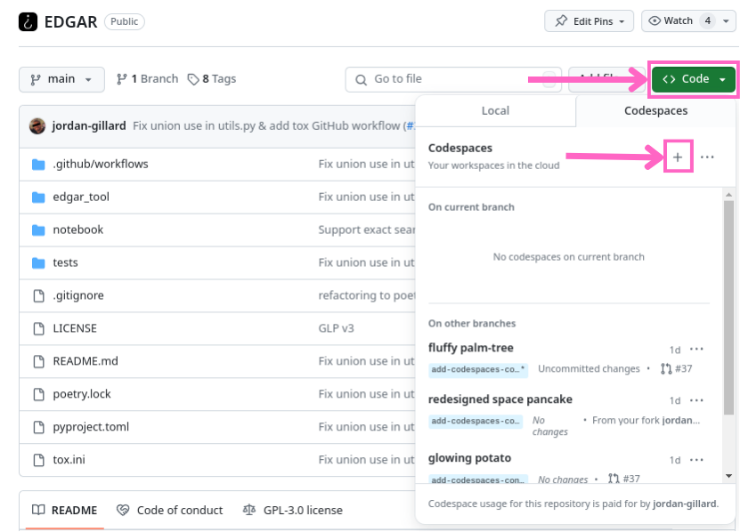

# bellingcat/EDGAR

<a href="https://www.bellingcat.com"></a><!--
--><a href="https://discord.gg/bellingcat"></a><!--
--><a href="https://colab.research.google.com/github/bellingcat/EDGAR/blob/main/notebook/Bellingcat_EDGAR_Tool.ipynb"><!--
--><a href="https://www.bellingcat.com/donate/"></a>
</a>

This is a command line interface to search and retrieve corporate and financial data from the United States Securities and Exchange Commission (SEC).

## What is the SEC's EDGAR database?

EDGAR is a database of corporate filings maintained by the SEC.
These filings contain a wealth of quantitative and qualitative information on every legal entity that issues non-exempt securities in the United States.
Whether you are looking to study the fundamentals of your favorite stocks or to track the corporate webs weaved by a person or company of interest, EDGAR is the place to do it.

## Installation 🪄

[
](https://pypi.org/project/edgar-tool/)


You can install this tool directly from the [official PyPi release](https://pypi.org/project/edgar-tool/).

```bash
pip install edgar-tool
```

The CLI also supports autocompletion, which is **highly recommended**. You can install autocomplete for your shell by typing

```bash
edgar --install-completion
```

Autocomplete makes it really easy to use the CLI, since you only have to type the first few characters of CLI commands, keyword arguments, or available values, followed by the `tab ↹` key to fill in the rest of the characters.

## Usage - Text Search 🔎

### What is the text search tool?

If you're interested in finding all the documents mentioning a certain person, company or phrase in the EDGAR database, you can do that via the [full text search page](https://www.sec.gov/edgar/search/#).

It isn't always easy to get the information you might need from the SEC, so this Python tool lets you download the search results to a file without having to go through all the pages of results by hand.

This is a command line tool that takes a search query, queries the SEC's EDGAR database, and downloads the search results into a CSV file that can be opened in a spreadsheet program (such as Excel).

### Examples

Display help message describing all supported arguments along with their usage, aliases and eventual default values (type `q` to exit)

```shell
edgar text-search --help
```

Basic usage (defaults to searching the last 5 years of records)

```shell
edgar text-search John Doe
```

You can wrap a phrase in quotes if you want an exact match.
This works in both POSIX-compliant shells (Linux/Bash) and Windows PowerShell environments.

For example, the following usage will search for the exact phrase `"John Doe"` and treat `Pharmaceuticals` and
`Chemicals` as partial search parameters.

```shell
edgar text-search "John Doe" Pharmaceuticals Chemicals
```

Usage with date range and export to custom CSV file

```shell
edgar text-search Tsunami Hazards --start-date 2021-01-01 --end-date 2021-12-31 --output my_custom.csv
```

### Usage with filing category or single forms

```shell
edgar text-search Hurricane Damage --filing-category registration_statements
```

```shell
edgar text-search Hurricane Damage --single-form 1-K --single-form 1-SA
# or
edgar text-search Hurricane Damage -sf 1-K -sf 1-SA
```

Usage specifying the location of incorporation. Note that `--incorporated-in` and `--principal-executive-offices-in` use [ISO 3166-1 alpha-3](https://en.wikipedia.org/wiki/ISO_3166-1_alpha-3) codes for countries (like USA, CAN, GBR), [ISO_3166-2:US](https://en.wikipedia.org/wiki/ISO_3166-2:US) state codes (like NY, CA, IL), and [ISO_3166-2:CA](https://en.wikipedia.org/wiki/ISO_3166-2:CA) province/territory codes (like AB, BC, NB).

```shell
edgar text-search oil --incorporated-in EGY
# or
edgar text-search oil -ii EGY
```

More advanced usage specifying more arguments, with export to JSON or JSON Lines formats

```shell
# Simply specify the output file format suffix to .csv, .json, or .jsonl
edgar text-search "Marjorie Taylor Greene" --output results.csv

edgar text-search Volcano Monitoring --start-date 2021-01-01 --end-date 2021-12-31 \
    --output results.json --filing-category all_annual_quarterly_and_current_reports \
    --entity-id 0001030717

edgar text-search Calabarzon --start-date 2021-01-01 -o results.jsonl \
    --filing-category all_annual_quarterly_and_current_reports
```

### Detailed `edgar text-search` CLI usage

<details>
<summary>Expand to view detailed feature information</summary>

**Usage**:

```console
$ edgar text-search [OPTIONS] TEXT...
```

**Arguments**:

- `TEXT...`: Search filings for a word or a list of words. A filing must contain all the words to return. To search for an exact phrase, use double quotes, like "fiduciary product". [required]

**Options**:

- `-o, --output TEXT`: Name of the output file to save results to. Accepts .csv, .json, and .jsonl extensions. [default: edgar_search_results_20250315_200420.csv]
- `--date-range [all|10y|5y|1y|30d]`: Date range of the search. Use 'all' to search all records since 2001. [default: 5y]
- `--start-date [%Y-%m-%d]`: Start date of the search in YYYY-MM-DD format (i.e. 2024-07-28).
- `--end-date [%Y-%m-%d]`: End date of the search in YYYY-MM-DD format (i.e. 2024-07-28) [default: 2025-03-15]
- `--entity-id TEXT`: Company name, ticker, CIK number or individual's name.
- `--filing-category [all|custom|all_except_section_16|all_annual_quarterly_and_current_reports|all_section_16|beneficial_ownership_reports|exempt_offerings|registration_statements|filing_review_correspondence|sec_orders_and_notices|proxy_materials|tender_offers_and_going_private_tx|trust_indentures]`: Form group to search for. Use 'custom' or do not set if using --single-form/-sf.
- `-sf, --single-form [1-A POS|1-A-W|1-A|1-E AD|1-K|1-SA|1-U|1-Z-W|1-Z|1|10-12B|10-12G|10-D|10-K|10-KT|10-Q|10-QT|11-K|13F-HR|13F-NT|13FCONP|144|15-12B|15-12G|15-15D|15F-12B|15F-12G|15F-15D|18-12B|18-K|19B-4E|2-A|20-F|20FR12B|20FR12G|24F-2NT|25-NSE|25|253G1|253G2|253G4|3|305B2|4|40-17F1|40-17F2|40-17G|40-202A|40-203A|40-206A|40-24B2|40-33|40-6B|40-8B25|40-APP|40-F|40-OIP|40FR12B|424A|424B1|424B2|424B3|424B4|424B5|424B7|424B8|424H|425|485APOS|485BPOS|485BXT|486APOS|486BPOS|486BXT|487|497|497AD|497H2|497J|497K|497VPI|497VPU|5|6-K|6B NTC|6B ORDR|8-A12B|8-A12G|8-K|8-K12B|8-K12G3|8-M|8F-2 NTC|8F-2 ORDR|ABS-15G|ABS-EE|ADV-E|ADV-H-C|ADV-H-T|ADV-NR|ANNLRPT|APP NTC|APP ORDR|APP WD|APP WDG|ARS|ATS-N-C|ATS-N|ATS-N/UA|AW WD|AW|C-AR-W|C-AR|C-TR-W|C-TR|C-U-W|C-U|C-W|C|CB|CERT|CERTARCA|CERTBATS|CERTCBO|CERTNAS|CERTNYS|CERTPAC|CFPORTAL|CORRESP|CT ORDER|D|DEF 14A|DEF 14C|DEFA14A|DEFA14C|DEFC14A|DEFM14A|DEFM14C|DEFN14A|DEFR14A|DEFR14C|DEL AM|DFAN14A|DFRN14A|DOS|DOSLTR|DRS|DRSLTR|DSTRBRPT|EFFECT|F-1|F-10|F-10EF|F-10POS|F-1MEF|F-3|F-3ASR|F-3D|F-4|F-4MEF|F-6 POS|F-6|F-6EF|F-7 POS|F-7|F-8|F-80|F-80POS|F-9 POS|F-9|F-N|F-X|FOCUSN|FWP|G-FIN|IRANNOTICE|MA-A|MA-I|MA-W|MA|MSD|MSDW|N-1|N-14 8C|N-14|N-14MEF|N-18F1|N-1A|N-2 POSASR|N-2|N-23C-2|N-23C3A|N-23C3B|N-2ASR|N-2MEF|N-30B-2|N-30D|N-4|N-5|N-54A|N-54C|N-6|N-6F|N-8A|N-8B-2|N-8F NTC|N-8F ORDR|N-8F|N-CEN|N-CR|N-CSR|N-CSRS|N-MFP|N-MFP1|N-MFP2|N-PX|N-Q|N-VP|N-VPFS|NO ACT|NPORT-EX|NPORT-NP|NPORT-P|NRSRO-CE|NRSRO-UPD|NSAR-A|NSAR-AT|NSAR-B|NSAR-BT|NSAR-U|NT 10-D|NT 10-K|NT 10-Q|NT 11-K|NT 20-F|NT N-CEN|NT N-MFP|NT N-MFP1|NT N-MFP2|NT NPORT-P|NT-NCEN|NT-NCSR|NT-NSAR|NTN 10D|NTN 10K|NTN 10Q|OIP NTC|OIP ORDR|POS 8C|POS AM|POS AMI|POS EX|POS462B|POS462C|POSASR|PRE 14A|PRE 14C|PREC14A|PREM14A|PREM14C|PREN14A|PRER14A|PRER14C|PRRN14A|PX14A6G|PX14A6N|QRTLYRPT|QUALIF|REG-NR|REVOKED|RW WD|RW|S-1|S-11|S-11MEF|S-1MEF|S-20|S-3|S-3ASR|S-3D|S-3DPOS|S-3MEF|S-4 POS|S-4|S-4EF|S-4MEF|S-6|S-8 POS|S-8|S-B|SBSE-A|SBSE-BD|SBSE-C|SBSE-W|SBSE|SC 13D|SC 13E3|SC 13G|SC 14D9|SC 14F1|SC 14N|SC TO-C|SC TO-I|SC TO-T|SC14D1F|SC14D9C|SC14D9F|SD|SE|SEC ACTION|SEC STAFF ACTION|SEC STAFF LETTER|SF-3|SL|STOP ORDER|SUPPL|T-3|TA-1|TA-2|TA-W|TACO|UNDER|UPLOAD|X-17A-5]`: List of single forms to search for (e.g. `-sf 10-K -sf "PRE 14A"`)
- `-peoi, --principal-executive-offices-in [AL|AK|AZ|AR|CA|CO|CT|DE|DC|FL|GA|HI|ID|IL|IN|IA|KS|KY|LA|ME|MD|MA|MI|MN|MS|MO|MT|NE|NV|NH|NJ|NM|NY|NC|ND|OH|OK|OR|PA|RI|SC|SD|TN|TX|UT|VT|VA|WA|WV|WI|WY|AB|BC|CAN|MB|NB|NL|NS|ON|PE|QC|SK|YT|AFG|ALA|ALB|DZA|ASM|AND|AGO|AIA|ATA|ATG|ARG|ARM|ABW|AUS|AUT|AZE|BHS|BHR|BGD|BRB|BLR|BEL|BLZ|BEN|BMU|BTN|BOL|BIH|BWA|BVT|BRA|IOT|BRN|BGR|BFA|BDI|KHM|CMR|CPV|CYM|CAF|TCD|CHL|CHN|CXR|CCK|COL|COM|COG|COD|COK|CRI|CIV|HRV|CUB|CYP|CZE|DNK|DJI|DMA|DOM|ECU|EGY|SLV|GNQ|ERI|EST|ETH|FLK|FRO|FJI|FIN|FRA|GUF|PYF|ATF|GAB|GMB|GEO|DEU|GHA|GIB|GRC|GRL|GRD|GLP|GUM|GTM|GGY|GIN|GNB|GUY|HTI|HMD|VAT|HND|HKG|HUN|ISL|IND|IDN|IRN|IRQ|IRL|IMN|ISR|ITA|JAM|JPN|JEY|JOR|KAZ|KEN|KIR|PRK|KOR|KWT|KGZ|LAO|LVA|LBN|LSO|LBR|LBY|LIE|LTU|LUX|MAC|MKD|MDG|MWI|MYS|MDV|MLI|MLT|MHL|MTQ|MRT|MUS|MYT|MEX|FSM|MDA|MCO|MNG|MNE|MSR|MAR|MOZ|MMR|NAM|NRU|NPL|NLD|ANT|NCL|NZL|NIC|NER|NGA|NIU|NFK|MNP|NOR|OMN|PAK|PLW|PSE|PAN|PNG|PRY|PER|PHL|PCN|POL|PRT|PRI|QAT|REU|ROU|RUS|RWA|BLM|SHN|KNA|LCA|MAF|SPM|VCT|WSM|SMR|STP|SAU|SEN|SRB|SYC|SLE|SGP|SVK|SVN|SLB|SOM|ZAF|SGS|ESP|LKA|SDN|SUR|SJM|SWZ|SWE|CHE|SYR|TWN|TJK|THA|TLS|TGO|TKL|TON|TTO|TUN|TUR|TKM|TCA|TUV|UGA|UKR|ARE|GBR|UMI|URY|UZB|VUT|VEN|VNM|VGB|VIR|WLF|ESH|YEM|ZMB|ZWE|XX]`: Search for the primary location associated with a filing. The principal executive office is where the company's top management operates and conducts key business decisions. The location could be a US state or territory, a Canadian province, or a country.
- `-ii, --incorporated-in [AL|AK|AZ|AR|CA|CO|CT|DE|DC|FL|GA|HI|ID|IL|IN|IA|KS|KY|LA|ME|MD|MA|MI|MN|MS|MO|MT|NE|NV|NH|NJ|NM|NY|NC|ND|OH|OK|OR|PA|RI|SC|SD|TN|TX|UT|VT|VA|WA|WV|WI|WY|AB|BC|CAN|MB|NB|NL|NS|ON|PE|QC|SK|YT|AFG|ALA|ALB|DZA|ASM|AND|AGO|AIA|ATA|ATG|ARG|ARM|ABW|AUS|AUT|AZE|BHS|BHR|BGD|BRB|BLR|BEL|BLZ|BEN|BMU|BTN|BOL|BIH|BWA|BVT|BRA|IOT|BRN|BGR|BFA|BDI|KHM|CMR|CPV|CYM|CAF|TCD|CHL|CHN|CXR|CCK|COL|COM|COG|COD|COK|CRI|CIV|HRV|CUB|CYP|CZE|DNK|DJI|DMA|DOM|ECU|EGY|SLV|GNQ|ERI|EST|ETH|FLK|FRO|FJI|FIN|FRA|GUF|PYF|ATF|GAB|GMB|GEO|DEU|GHA|GIB|GRC|GRL|GRD|GLP|GUM|GTM|GGY|GIN|GNB|GUY|HTI|HMD|VAT|HND|HKG|HUN|ISL|IND|IDN|IRN|IRQ|IRL|IMN|ISR|ITA|JAM|JPN|JEY|JOR|KAZ|KEN|KIR|PRK|KOR|KWT|KGZ|LAO|LVA|LBN|LSO|LBR|LBY|LIE|LTU|LUX|MAC|MKD|MDG|MWI|MYS|MDV|MLI|MLT|MHL|MTQ|MRT|MUS|MYT|MEX|FSM|MDA|MCO|MNG|MNE|MSR|MAR|MOZ|MMR|NAM|NRU|NPL|NLD|ANT|NCL|NZL|NIC|NER|NGA|NIU|NFK|MNP|NOR|OMN|PAK|PLW|PSE|PAN|PNG|PRY|PER|PHL|PCN|POL|PRT|PRI|QAT|REU|ROU|RUS|RWA|BLM|SHN|KNA|LCA|MAF|SPM|VCT|WSM|SMR|STP|SAU|SEN|SRB|SYC|SLE|SGP|SVK|SVN|SLB|SOM|ZAF|SGS|ESP|LKA|SDN|SUR|SJM|SWZ|SWE|CHE|SYR|TWN|TJK|THA|TLS|TGO|TKL|TON|TTO|TUN|TUR|TKM|TCA|TUV|UGA|UKR|ARE|GBR|UMI|URY|UZB|VUT|VEN|VNM|VGB|VIR|WLF|ESH|YEM|ZMB|ZWE|XX]`: Search for the primary location associated with a filing. Incorporated in refers to the location where the company was legally formed and registered as a corporation. The location could be a US state or territory, a Canadian province, or a country.
- `--help`: Show this message and exit.

</details>

## Usage - RSS Feed 📰

### What is the RSS feed customized retrieval tool ?

The SEC publishes a live feed of filings. This part of the tool lets you monitor particular tickers for new filings, so you can get to-the-minute updates.

The output is a CSV file containing the company and filings' metadata, which can be opened in a spreadsheet program (such as Excel).

### Examples

```bash
# Display help message describing all supported arguments along with their usage
edgar rss --help

# Basic one-off usage with export to CSV
edgar rss GOOG --output rss_feed.csv

# Periodic usage specifying 10 minutes interval duration, with export to JSON
edgar rss AAPL GOOG MSFT --output rss_feed.json --every-n-mins 10

# Same example as above, using aliases and exporting to JSONLines (.jsonl)
edgar rss AAPL GOOG MSFT -o rss_feed.jsonl -e 10
```

### Detailed Feature Information

<details>
<summary>Expand to view detailed feature information</summary>

#### Companies CIK to Ticker mapping

Since the RSS feed uses CIKs instead of tickers, the tool includes a mapping of CIKs to tickers, which is used to filter the feed by ticker.
This mapping is obtained from the [SEC website](https://www.sec.gov/files/company_tickers.json) and is updated on user request.

#### Periodic retrieval

The RSS feed data returns the last 200 filings and is updated every 10 minutes (which doesn't mean all tickers are updated every 10 minutes).
The tool can fetch the feed either once on-demand or at regular intervals.

</details>

## Development 👨‍💻

<details>
<summary>Expand to view information for developers</summary>

This section describes how to install the project to run it from source, for example if you want to build new features.

### Developing locally

```bash
# Clone the repository
git clone https://github.com/bellingcat/EDGAR.git

# Change directory to the project folder
cd EDGAR
```

This project uses [Poetry](https://python-poetry.org/docs) for dependency management and packaging.

```bash
# Install Poetry if you haven't already
pip install poetry

# Install dependencies
poetry install

# Set up pre-commit hooks to keep your code formatted
poetry run pre-commit install
```

Check out [Important commands](#important-commands) below for next steps.

### Developing using a GitHub Codespace

This project uses a custom Development Container supported by GitHub Codespaces. Creating a new Codespace automatically takes care of installing all supported Python interpreters, the Poetry package manager, Python dependencies, and pre-commit hooks for you.

To create a new Codespace:

1. Click on the `<> Code` dropdown on the GitHub UI.
1. Click the `+` icon to create a new Codespace.

The Codespace will open for you automatically.



Check out [Important commands](#important-commands) below for next steps.

### Important commands

```bash
# Run the tool
poetry run edgar-tool --help

# Run unit tests using your Poetry environment's Python interpreter
poetry run pytest

# Run unit tests with tox
poetry run tox -- run-parallel
```

You can skip having to write `poetry run` before each command by activating Poetry's virtual environment with `poetry shell`. Once activated the following code is equivalent to the above:

```bash
# Spawn shell within Poetry's virtual environment
poetry shell

# Run the tool
edgar-tool --help

# Run unit tests using your Poetry environment's Python interpreter
pytest

# Run unit tests with tox
tox run-parallel
```

This is an actual example copy/pasted from a terminal:

```console
@edgar-dev ➜ /workspaces/EDGAR (main) $ pytest
bash: pytest: command not found

@edgar-dev ➜ /workspaces/EDGAR (main) $ poetry shell
Spawning shell within /home/vscode/.cache/pypoetry/virtualenvs/edgar-tool-vrvn8V2D-py3.12
(edgar-tool-py3.12) @edgar-dev ➜ /workspaces/EDGAR (main) $ pytest
================= test session starts ==================
platform linux -- Python 3.12.4, pytest-8.3.1, pluggy-1.5.0
rootdir: /workspaces/EDGAR
configfile: pyproject.toml
collected 1 item

tests/test_cli.py .                              [100%]

================== 1 passed in 0.20s ===================
(edgar-tool-py3.12) @edgar-dev ➜ /workspaces/EDGAR (main) $
```

</details>
